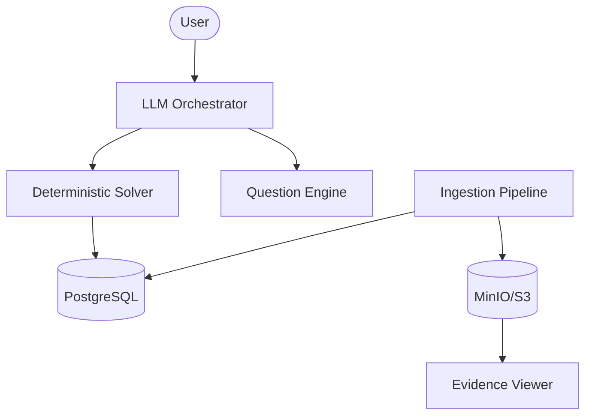

# ⚡ Silicon-Pilot (Production Grade)

**Engineering-Grade MCU & Component Selection System**

Silicon-Pilot is a **deterministic, parametric hardware-selection engine** that provides evidence-backed recommendations for microcontrollers. Unlike generic AI chatbots, Silicon-Pilot uses a **deterministic constraint solver** over a **PostgreSQL parametric database** with **full provenance**.

Every recommendation is deterministic, constraint-verified, and citation-backed with datasheet references, including rendered snippets of the source documents.

---

## 🚀 Key Features

### ⚙️ Deterministic Selection Engine
- **Zero Hallucination**: No specs are invented. All data is verified from manufacturers.
- **100% Constraint Satisfaction**: Hard requirements are guaranteed to be met.
- **Stable Results**: Same input → Same output (tested over 100 runs).

### 📊 Parametric PostgreSQL Database
- **Exhaustive STM32 Support**: Ingested data for all major STM32 families.
- **Evidence-Backed Fields**: Every spec field (Flash, RAM, Peripherals, Voltage) links to a source URL, page, and bbox.
- **Conflict Detection**: Identifies and flags discrepancies between different manufacturer sources.

### 📚 Evidence-Backed RAG
- **Datasheet Provenance**: Direct links to manufacturer PDFs.
- **Snippet Rendering**: Visual proof for every recommended value.
- **Zero-Trust Logic**: Only publishes data above a specific confidence threshold.

### 🤖 AI Reasoning Layer
- **NL → Constraint Parsing**: Converts "I want to build a drone" into engineering requirements.
- **Information Gain Q&A**: Asks only the high-leverage questions to narrow down the search.
- **Explainable Scoring**: Provides a detailed breakdown of why one part is ranked higher than another.

---

## 🏗️ System Architecture



---

## 📖 Documentation

- [**RUN_INSTRUCTIONS.md**](RUN_INSTRUCTIONS.md): Detailed setup for Docker and Local environments.
- [**TEST_GUIDE.md**](TEST_GUIDE.md): Guide to running unit, integration, and golden tests.
- [**DATA_INGESTION_GUIDE.md**](DATA_INGESTION_GUIDE.md): How to collect and ingest real datasheet data.
- [**SYSTEM_ARCHITECTURE.md**](SYSTEM_ARCHITECTURE.md): Technical deep dive into filters, solvers, and extraction.

---

## 🚀 Quick Start (Production)

### 1. Requirements
- Docker & Docker Compose
- OpenAI API Key

### 2. Startup
```powershell
cp .env.template .env
# Edit .env and add your OPENAI_API_KEY
docker compose up -d
```

### 3. Exhaustive Data Ingestion
```powershell
python scripts/collect_stm32_datasheets.py
python scripts/ingest_datasheets.py
```

### 4. API & Verification
- **API Docs**: `http://localhost:8000/docs`
- **Verification**: `python quick_test.py`

---

## 🧪 Implementation Status

| Component | Status | Description |
|-----------|--------|-------------|
| **Database** | ✅ Done | PostgreSQL with evidence tracking |
| **Ingestion** | ✅ Done | Multi-strategy PDF/Table/OCR extraction |
| **Solver** | ✅ Done | Zero-tolerance hard filter + ranking |
| **AI Layer** | ✅ Done | NLP parser + Question Engine |
| **Evidence** | ✅ Done | S3 snippet rendering & provenance |

---

## 📄 License
MIT License - Developed for Advanced Agentic Coding.

**Author:** [Anurag9000](https://github.com/Anurag9000)
**Version:** 1.0.0 (Silicon-Pilot MVP)
